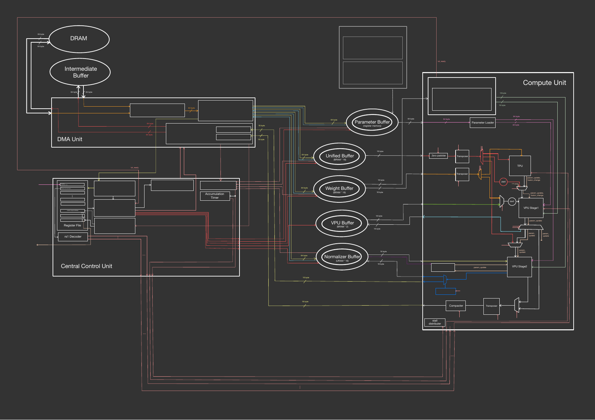

# NPU Overview (Architecture Diagram)

> 원본은 다이어그램(PDF)이며, 아래는 블록 구성 요약. RoCC(`custom0 rs1, rs2`) 인터페이스로 명령을 받는
> Rocket Chip 기반 가속기 구조.

📎 [원본 PDF 다운로드](npu-overview-diagram.pdf) 

## 주요 블록

- **Buffers:** Unified Buffer(BRAM×16), Weight Buffer(BRAM×16), VPU Buffer(BRAM×2),
  Normalizer Buffer(URAM×16), Parameter Buffer(register memory)
- **Compute Unit:** Zero-padder, Compacter, Transposer×2, VPU Stage1/2, TPU
- **Central Control Unit:** Register File, Accumulation Timer, rs1 Decoder, Stall Generator
- **DMA Unit:** DRAM r/w, TL Burst Initializer, 목적지별 read/write 서브 컨트롤러 다수
  (OCM/RF/LUT write controller 등)
- **Interrupt Generator:** 완료 감지, irq 발생

## 데이터 폭

- OCM ↔ DMA: 64 Byte (512-bit)
- Compute Unit 내부: 16 Byte (128-bit), 일부 32 Byte 구간 존재
